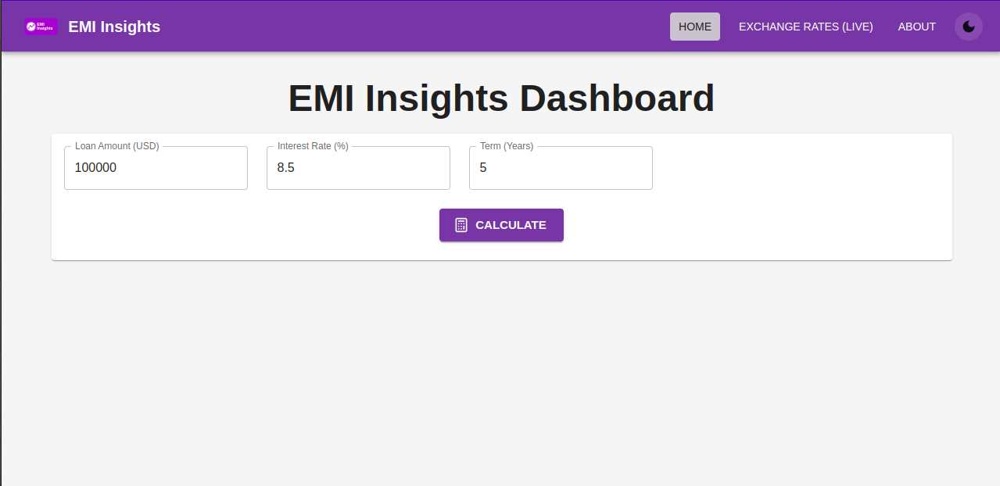
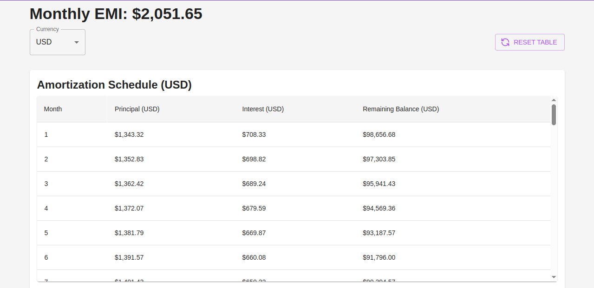
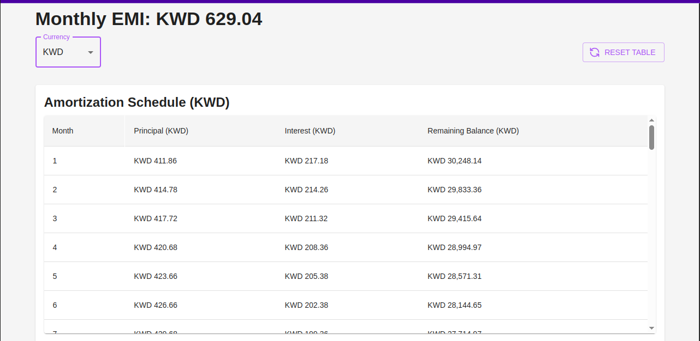
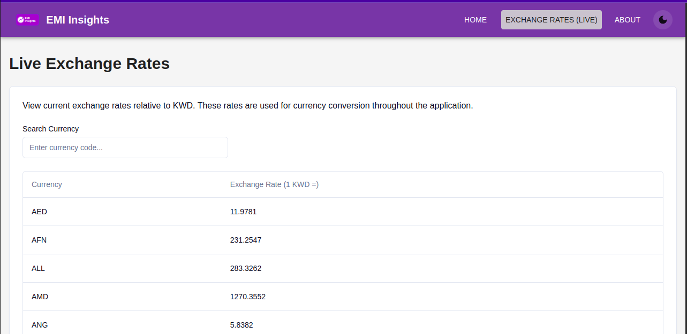
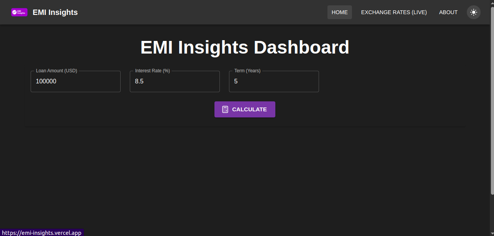

# EMI Insights App

The EMI Insights App is a web application designed to provide users with tools for financial planning, specifically focusing on loan EMI calculations and live currency exchange rate information. It aims to simplify these financial tasks through an intuitive and responsive user interface.

[](https://reactjs.org/)
[](https://www.typescriptlang.org/)
[](https://vitejs.dev/)
[](https://mui.com/)
[](https://ui.shadcn.com/)
[](https://tailwindcss.com/)
[](https://vercel.com/)
[](LICENSE)

**Live Demo:** [https://emi-insights.vercel.app/](https://emi-insights.vercel.app/)

---

## Overview

## Table of Contents

- [EMI Insights App](#emi-insights-app)
  - [Overview](#overview)
  - [Table of Contents](#table-of-contents)
  - [Features](#features)
  - [Screenshots](#screenshots)
  - [Tech Stack](#tech-stack)
  - [Environment Variables](#environment-variables)
  - [Getting Started](#getting-started)
    - [Prerequisites](#prerequisites)
    - [Installation](#installation)
    - [Running Locally](#running-locally)
    - [Building for Production](#building-for-production)
  - [Serverless Functions](#serverless-functions)
  - [Contributing](#contributing)
  - [License](#license)

---

## Features

*   **Loan EMI Calculator:**
    *   Calculate Equated Monthly Installments (EMI) for loans.
    *   Inputs: Loan Amount (in USD), Annual Interest Rate, and Loan Term in Years.
    *   Outputs: Calculated Monthly EMI and a detailed Amortization Schedule (showing principal, interest, and remaining balance for each payment).
    *   View EMI and amortization figures in various user-selected currencies.
*   **Live Currency Exchange Rates:**
    *   View a list of currencies and their up-to-date exchange rates relative to a base currency (USD).
    *   Data sourced from the ExchangeRate-API.
    *   Searchable and paginated list of currencies.
*   **Currency Conversion:**
    *   Seamlessly convert calculated EMI and amortization schedule amounts between different currencies.
*   **User Interface (UI) & User Experience (UX):**
    *   Modern, clean, and intuitive design.
    *   Responsive layout for optimal viewing on desktop, tablet, and mobile devices.
    *   Theme toggle for Light and Dark mode support.
    *   Built with a hybrid approach using Material UI (MUI) and Shadcn UI components.
*   **Error Handling:**
    *   Global Error Boundary to catch unexpected runtime errors and display a user-friendly fallback.
    *   Clear communication of API or calculation errors to the user via toasts or alerts.

---

## Screenshots

*   **Loan Calculator Page:**
    
*   **EMI Results & Amortization Table:**
    
*   **Converted Currency EMI Results Table:**
    
*   **Live Exchange Rates Page:**
    
*   **Dark Mode:**
    

---

## Tech Stack

**Frontend:**

*   **Framework/Library:** React (v18+)
*   **Language:** TypeScript
*   **Build Tool:** Vite
*   **UI Libraries:**
    *   **Material UI (MUI):** For its comprehensive component library (Grid, Card, Table, Select, etc.) and responsive layout capabilities.
    *   **Shadcn UI:** Leveraging Tailwind CSS and Radix UI primitives for modern, accessible, and highly customizable components (Button, Toaster, Tooltip, etc.). Theming is synchronized with MUI.
    *   **Tailwind CSS:** For utility-first styling and as the styling foundation for Shadcn UI components.
*   **State Management:**
    *   Local Component State (`useState`, `useReducer`)
    *   React Context API (for `CurrencyContext` and `ThemeProviderContext`)
    *   **TanStack Query (React Query):** For managing server state, caching, and data synchronization for exchange rates.
*   **Routing:** React Router DOM (v6+)
*   **API Communication:** Axios

**Backend (Serverless):**

*   **Platform:** Vercel Serverless Functions
*   **Runtime:** Node.js
*   **Language:** TypeScript (compiled to JavaScript)
*   **Purpose:** Acts as a secure backend proxy to fetch exchange rates from the external ExchangeRate-API, protecting the API key.

**External Services:**

*   **ExchangeRate-API:** For real-time currency exchange rate data.

---

## Environment Variables

This project requires an API key from [ExchangeRate-API](https://www.exchangerate-api.com/) to fetch live currency data. The API key is used by the backend serverless function to protect it from being exposed on the client-side.

When deploying to Vercel (or any other hosting provider that supports serverless functions), you need to set the following environment variables in your project settings:

*   `EXCHANGE_RATE_API_KEY`: Your API key obtained from ExchangeRate-API.
*   `EXCHANGE_RATE_API_BASE_URL`: The base URL for the ExchangeRate-API (e.g., `https://v6.exchangerate-api.com/v6`). This is used by the serverless function.

For local development, create a `.env.local` file in the root of your project and add these variables:

```bash
# .env.local
EXCHANGE_RATE_API_KEY="your_actual_api_key_here"
EXCHANGE_RATE_API_BASE_URL="https://v6.exchangerate-api.com/v6"
```

---

## Getting Started

Follow these instructions to get a copy of the project up and running on your local machine for development and testing purposes.

### Prerequisites

*   **Node.js:** Version 18.x or later is recommended. You can download it from nodejs.org.
*   **Package Manager:** npm (v9.x or later), yarn (v1.22.x or later), or pnpm. npm is included with Node.js.
*   **Git:** For cloning the repository.
*   **Vercel CLI (Optional):** Useful for local testing of Vercel serverless functions. Install globally via `npm install -g vercel`.
*   **ExchangeRate-API Key:** Sign up at ExchangeRate-API to get an API key.

### Installation

1.  **Clone the repository:**
    ```bash
    git clone https://github.com/RoystonDAlmeida/emi-insights.git
    cd emi-insights/
    ```

2.  **Install dependencies:**
    Navigate to the project directory and install the required packages using your preferred package manager:
    ```bash
    npm install
    # or
    # yarn install
    # or
    # pnpm install
    ```

3.  **Set up Environment Variables:**
    Create a `.env.local` file in the root of the project as described in the Environment Variables section.

### Running Locally

To start the development server with hot-reloading:

```bash
npm run dev
# or
# yarn dev
# or
# pnpm dev
```

This will typically start the application, and you can access it at `http://localhost:5173` (Vite's default) or another port if specified.

If you want to run the application along with the serverless functions in an environment that closely mimics Vercel, use the Vercel CLI:

```bash
vercel dev
```
This command also uses the `.env.local` file for environment variables.

### Building for Production

To create an optimized production build of the application:

```bash
npm run build
# or
# yarn build
# or
# pnpm build
```
This command generates static assets in the `dist` folder, which are ready for deployment.

---

## Serverless Functions

This application utilizes Vercel Serverless Functions, written in TypeScript and located in the `/api` directory.

*   **Primary Purpose:** They serve as a secure backend proxy. For instance, the `/api/exchange-rates` function is responsible for fetching live currency exchange rates from the external ExchangeRate-API.
*   **API Key Protection:** This architecture is key to safeguarding the `EXCHANGE_RATE_API_KEY`. The key is stored as a server-side environment variable and is never exposed to the client-side application, enhancing security.
*   **Local Development:** When you run `vercel dev`, these serverless functions are served locally, allowing for integrated development and testing.
*   **Deployment:** Vercel automatically detects and deploys functions from the `/api` directory. No separate deployment steps are required for these functions.

---

## Contributing

To contribute a new feature to the project, kindly follow the steps below:

1.  **Fork the Project:** Click the 'Fork' button at the top right of the project's GitHub page.
2.  **Create your Feature Branch:** (`git checkout -b feature/AmazingFeature`)
3.  **Commit your Changes:** (`git commit -m 'Add some AmazingFeature'`)
4.  **Push to the Branch:** (`git push origin feature/AmazingFeature`)
5.  **Open a Pull Request:** Go to the original repository and open a new pull request. Please provide a clear description of the changes and why they are needed.

You can also contribute by reporting bugs, suggesting features, or improving documentation. Please open an issue on GitHub for such cases.

---

## License

This project is licensed under the MIT License. 